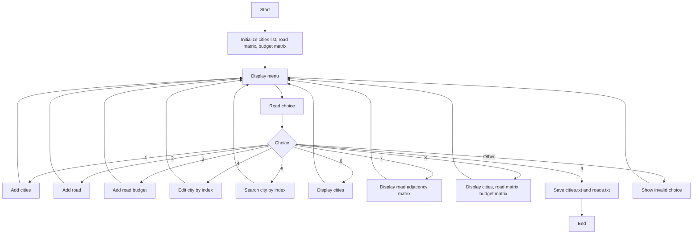

# Road Construction Budgeting System

This project is a graph-based C++ console application for managing Rwanda cities, roads, and road budgets with two adjacency matrices:

- `roadMatrix[i][j]` stores `1` when a road exists, otherwise `0`
- `budgetMatrix[i][j]` stores the road budget, otherwise `0.0`

The graph is undirected, so each road and budget is stored symmetrically in both directions.

## Build

```bash
g++ -std=c++17 -Wall -Wextra -pedantic main.cpp -o road_budget_system
```

## Files

- `cities.txt` stores indexed city names
- `roads.txt` stores unique roads and their budgets

## Mermaid Flowchart


