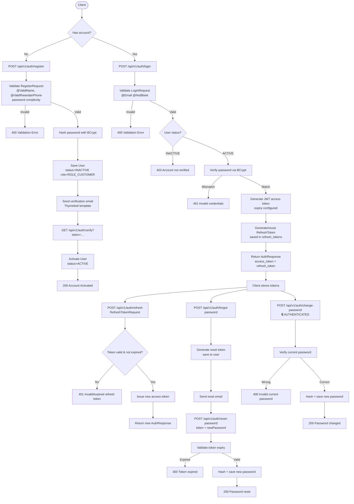
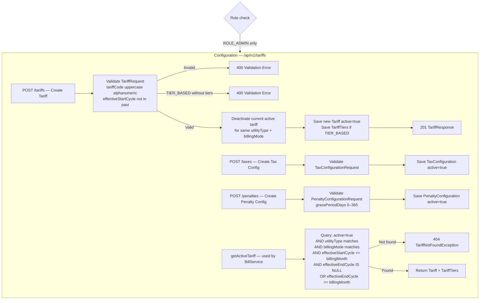
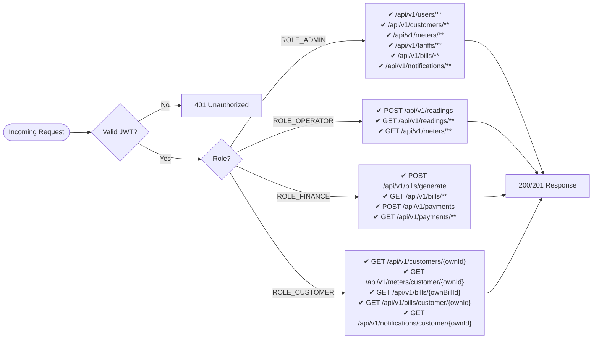
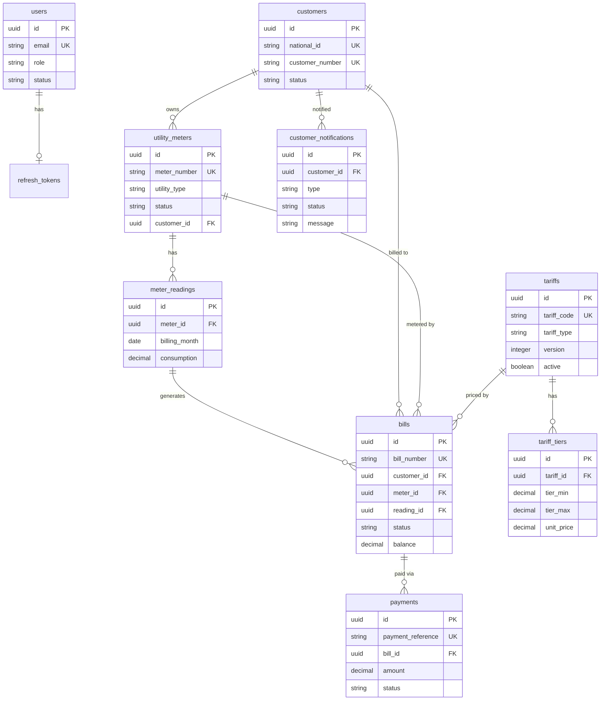

# Utility Billing System — Spring Boot Flow Diagrams

Mermaid diagrams covering all 7 system flows plus role authorization gates.

---

## Flow 1 — Authentication & Token Management



---

## Flow 2 — Customer & Meter Setup

```mermaid
flowchart TD
    GATE1{Role check} -- ROLE_ADMIN only --> CUST

    subgraph CUST [Customer Management — /api/v1/customers]
        CC[POST / — Create Customer]
        CC --> CC1[Validate CustomerRequest\n@ValidName @ValidNationalId\n@ValidRwandanPhone]
        CC1 -- Invalid --> ERR1[400 Validation Error]
        CC1 -- Valid --> CC2{nationalId exists?}
        CC2 -- Yes --> ERR2[409 DuplicateNationalIdException]
        CC2 -- No --> CC3[Generate customerNumber\nSave Customer status=ACTIVE]
        CC3 --> CC4[201 CustomerResponse]

        CU[PUT /{id} — Update Customer] --> CU1[Load customer or 404]
        CU1 --> CU2[Apply patch + save]

        CA[PATCH /{id}/activate] --> CA1[Set status=ACTIVE]
        CD[PATCH /{id}/deactivate] --> CD1[Set status=INACTIVE]

        CL[GET / — List paginated] --> CL1[Page of CustomerResponse]
        CG[GET /{id}] --> CG1{Own record or ADMIN?}
        CG1 -- No --> ERR3[403 Forbidden]
        CG1 -- Yes --> CG2[CustomerResponse]
    end

    GATE2{Role check} -- ROLE_ADMIN --> MREQ
    GATE2 -- ROLE_OPERATOR or ROLE_ADMIN --> MLIST

    subgraph METER [Meter Management — /api/v1/meters]
        MREQ[POST / — Assign Meter]
        MREQ --> MR1[Validate MeterRequest\n@Pattern uppercase alphanumeric\n@PastOrPresent installationDate]
        MR1 -- Invalid --> ERR4[400 Validation Error]
        MR1 -- Valid --> MR2{meterNumber exists?}
        MR2 -- Yes --> ERR5[409 DuplicateMeterNumberException]
        MR2 -- No --> MR3[Link to Customer\nSave Meter status=ACTIVE]
        MR3 --> MR4[201 MeterResponse]

        MLIST[GET / — List paginated]
        MLIST --> ML1[Page of MeterResponse]
        MLBYCUST[GET /customer/{id}] --> MC1{Own meters or ADMIN/OPERATOR?}
        MC1 -- No --> ERR6[403 Forbidden]
        MC1 -- Yes --> MC2[Page of MeterResponse]

        MA[PATCH /{id}/activate] --> MA1[Set status=ACTIVE]
        MDEACT[PATCH /{id}/deactivate] --> MD1[Set status=INACTIVE]
    end
```

---

## Flow 3 — Meter Reading Capture

```mermaid
flowchart TD
    GATE{Role check} -- ROLE_OPERATOR only --> RD

    subgraph RD [Meter Reading — /api/v1/readings]
        CR[POST / — Capture Reading]
        CR --> V1[Validate MeterReadingRequest\n@PastOrPresent readingDate\nbillingMonth not future]
        V1 -- Invalid --> ERR1[400 Validation Error]
        V1 -- Valid --> R1[Load UtilityMeter or 404]
        R1 --> R2{meter.status == ACTIVE?}
        R2 -- No --> ERR2[400 InactiveMeterException]
        R2 -- Yes --> R3{Reading exists for\nmeter + billingMonth?}
        R3 -- Yes --> ERR3[409 DuplicateReadingException]
        R3 -- No --> R4[Load previous reading\nfrom latest DB record for this meter]
        R4 --> R5{currentReading > previousReading?}
        R5 -- No --> ERR4[400 InvalidReadingException]
        R5 -- Yes --> R6[consumption = current - previous]
        R6 --> R7[Save MeterReading]
        R7 --> R8[201 MeterReadingResponse]

        RL[GET / — List all] --> RL1[ADMIN or OPERATOR]
        RLM[GET /meter/{meterId}] --> RM1[ADMIN or OPERATOR]
    end
```

---

## Flow 4 — Tariff / Tax / Penalty Configuration



---

## Flow 5 — Bill Generation & Calculation

```mermaid
flowchart TD
    GATE{Role check} -- ROLE_ADMIN or ROLE_FINANCE --> BG

    subgraph BG [Bill Generation — /api/v1/bills]
        GEN[POST /generate — BillGenerateRequest]
        GEN --> B1[Validate: billingMonth not future]
        B1 -- Invalid --> ERR1[400 Validation Error]
        B1 -- Valid --> B2[Load UtilityMeter or 404]
        B2 --> B3[Load Customer from meter or 404]
        B3 --> B4{customer.status == ACTIVE?}
        B4 -- No --> ERR2[400 InactiveCustomerException]
        B4 -- Yes --> B5[Load MeterReading for meter+billingMonth or 404]
        B5 --> B6[getActiveTariff\nutilityType + billingMode + billingMonth]
        B6 -- Not found --> ERR3[404 TariffNotFoundException]
        B6 -- Found --> B7{tariff.tariffType?}

        B7 -- FLAT --> FLAT[amount = consumption × tariff.unitPrice\nfor FLAT type only one unit price exists]
        B7 -- TIER_BASED --> TIER[Iterate TariffTiers sorted by tierMin\nFor each tier: slice = min consumption, tierMax - tierMin\namount += slice × tier.unitPrice]

        FLAT --> ADD
        TIER --> ADD

        ADD[Add fixed service charge\namount += tariff.fixedServiceCharge]
        ADD --> VAT[Apply VAT\nvatAmount = amount × tariff.vatRate / 100\namount += vatAmount]
        VAT --> LATE{Bill late?\ncurrentDate > dueDate estimate}
        LATE -- Yes --> PEN[Load active PenaltyConfiguration\npenalty = amount × penalty.rate / 100\namount += penalty]
        LATE -- No --> SAVE
        PEN --> SAVE

        SAVE[Save Bill\npaidAmount=0 balance=amount status=PENDING]
        SAVE --> NOTIFY[NotificationService.notifyBillGenerated\nCreate CustomerNotification row\nSend email via EmailService]
        NOTIFY --> DB_TRG[DB Trigger trg_bill_notification\nINSERT INTO customer_notifications\n'Dear X, Your MM/YYYY bill of Y FRW...']
        DB_TRG --> RESP[201 BillResponse]

        LIST[GET / — List bills paginated] --> L1[ADMIN or FINANCE]
        GETID[GET /{id}] --> G1{Own bill or ADMIN/FINANCE?}
        G1 -- No --> ERR4[403 Forbidden]
        G1 -- Yes --> G2[BillResponse]
        GETBYCUST[GET /customer/{customerId}] --> GC1[ADMIN, FINANCE, or own CUSTOMER]
    end
```

---

## Flow 6 — Payment Processing

```mermaid
flowchart TD
    GATE{Role check} -- ROLE_FINANCE only --> PAY

    subgraph PAY [Payment Processing — /api/v1/payments]
        RP[POST / — PaymentRequest]
        RP --> P1[Validate PaymentRequest\namount >= 0.01\npaymentReference uppercase alphanumeric]
        P1 -- Invalid --> ERR1[400 Validation Error]
        P1 -- Valid --> P2[Load Bill or 404]
        P2 --> P3{bill.status == PAID?}
        P3 -- Yes --> ERR2[400 Bill already fully paid]
        P3 -- No --> P4{amount <= bill.balance?}
        P4 -- No --> ERR3[400 OverpaymentException]
        P4 -- Yes --> P5[bill.paidAmount += amount\nbill.balance -= amount]
        P5 --> P6{bill.balance == 0?}
        P6 -- Yes --> PAID[bill.status = PAID]
        P6 -- No --> PARTIAL[bill.status = PARTIALLY_PAID]

        PAID --> NOTIFY[NotificationService.notifyPaymentReceived\nCreate CustomerNotification\nSend payment confirmation email]
        NOTIFY --> DB_TRG[DB Trigger trg_payment_bill_status\nRecalculate balance\nIf balance=0: UPDATE bills SET status=PAID\nINSERT INTO customer_notifications]

        PARTIAL --> SAVE
        DB_TRG --> SAVE
        SAVE[Save Payment record\nSave updated Bill]
        SAVE --> RESP[201 PaymentResponse]

        PL[GET / — List all payments] --> PL1[FINANCE only]
        PLB[GET /bill/{billId}] --> PB1[ADMIN or FINANCE]
    end
```

---

## Flow 7 — Notifications

```mermaid
flowchart TD
    subgraph NOTIF [Notification Flow]
        direction TB

        TRIGGER1[Bill Generated event\nBillService.generateBill]
        TRIGGER1 --> NS1[NotificationService.notifyBillGenerated bill]
        NS1 --> NS2[Build message:\n'Dear CustomerName,\nYour MM/YYYY utility bill\nof Amount FRW has been\nsuccessfully processed.']
        NS2 --> NS3[Save CustomerNotification\ntype=BILL_GENERATED status=PENDING]
        NS3 --> NS4[EmailService.sendCustomEmail\nThymeleaf bill-generated.html]
        NS4 --> NS5[Update status=SENT or FAILED]

        TRIGGER2[Full Payment event\nPaymentService.recordPayment]
        TRIGGER2 --> NS6[NotificationService.notifyPaymentReceived bill]
        NS6 --> NS7[Build payment confirmation message]
        NS7 --> NS8[Save CustomerNotification\ntype=PAYMENT_RECEIVED status=PENDING]
        NS8 --> NS9[EmailService.sendCustomEmail\nThymeleaf payment-received.html]
        NS9 --> NS10[Update status=SENT or FAILED]

        DB1[PostgreSQL Trigger\ntrg_bill_notification\nAFTER INSERT ON bills]
        DB1 --> DB2[INSERT customer_notifications\nwith exact required message format]

        DB3[PostgreSQL Trigger\ntrg_payment_bill_status\nAFTER INSERT ON payments]
        DB3 --> DB4[Recalculate balance\nIf balance=0: UPDATE bills SET status=PAID]
        DB4 --> DB5[INSERT customer_notifications\npayment received message]
    end

    subgraph NOTIF_API [Notification API — /api/v1/notifications]
        NL[GET / — All notifications] --> NL1[ROLE_ADMIN only]
        NLC[GET /customer/{customerId}] --> NC1{Own notifications or ADMIN?}
        NC1 -- No --> ERR[403 Forbidden]
        NC1 -- Yes --> NC2[Page of NotificationResponse]
    end
```

---

## Flow 8 — Role Authorization Gates (Summary)



---

## Entity Relationship Overview (Simplified)


